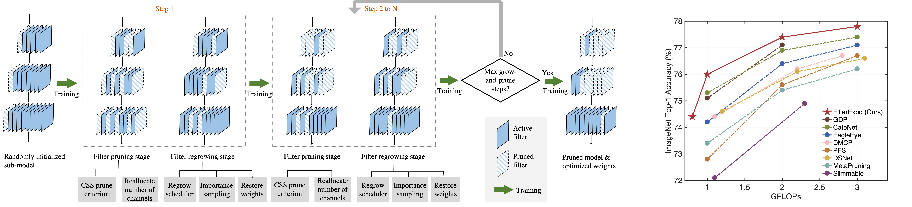

# CHEX: Channel Exploration for CNN Model Compression

This repository is the official implementation of the paper "CHEX: CHannel EXploration for CNN Model Compression".

## Highlights
Channel pruning has been broadly recognized as an effective technique to reduce the computation and memorycost of deep convolutional neural networks. However, conventional pruning methods have limitations in that: they are restricted to pruning process only, and they require a fully pretrained large model. Such limitations may lead to sub-optimal model quality as well as excessive memory and training cost. In this paper, we propose a novel Channel Exploration methodology, dubbed as CHEX, to rectify these problems. As opposed to pruning-only strategy, we propose to repeatedly prune and regrow the channels throughout the training process, which reduces the risk of pruning important channels prematurely. More exactly: From intra-layer’saspect, we tackle the channel pruning problem via a well-known column subset selection (CSS) formulation. From inter-layer’s aspect, our regrowing stages open a path for dynamically re-allocating the number of channels across all the layers under a global channel sparsity constraint. In addition, all the exploration process is done in a single training from scratch without the need of a pre-trained largemodel. Experimental results demonstrate that CHEX can effectively reduce the FLOPs of diverse CNN architectures on a variety of computer vision tasks, including image classification, object detection, instance segmentation, and 3D vision. For example, our compressed ResNet-50 model on ImageNet dataset achieves 76% top-1 accuracy with only 25% FLOPs of the original ResNet-50 model, outperforming previous state-of-the-art channel pruning methods.

<div align="center">
  
</div>

<!-- ## Dependency -->

<!-- This repository contains Dockerfile which extends the PyTorch NGC container and encapsulates some dependencies. In addition, ensure you have the following components: -->

<!-- * [NVIDIA Docker](https://github.com/NVIDIA/nvidia-docker) -->
<!-- * [PyTorch 20.12-py3 NGC container](https://ngc.nvidia.com/registry/nvidia-pytorch) or newer -->
<!-- * Supported GPUs: -->
<!--     * [NVIDIA Volta architecture](https://www.nvidia.com/en-us/data-center/volta-gpu-architecture/) -->

## Image Classification on ImageNet

```Shell
cd ./CLS
```

### Prepare the dataset

* We use ImageNet-1K, a widely used image classification dataset from the ILSVRC challenge. 
* [Download the images](http://image-net.org/download-images).
* Extract the training data
```Shell
mkdir train && mv ILSVRC2012_img_train.tar train/ && cd train
tar -xvf ILSVRC2012_img_train.tar && rm -f ILSVRC2012_img_train.tar
find . -name "*.tar" | while read NAME ; do mkdir -p "${NAME%.tar}"; tar -xvf "${NAME}" -C "${NAME%.tar}"; rm -f "${NAME}"; done
cd ..
```

* Extract the validation data and move the images to subfolders
```Shell
mkdir val && mv ILSVRC2012_img_val.tar val/ && cd val && tar -xvf ILSVRC2012_img_val.tar
wget -qO- https://raw.githubusercontent.com/soumith/imagenetloader.torch/master/valprep.sh | bash
```

* Docker setup
```Shell
docker build . -t nvidia_resnet50
nvidia-docker run --rm -it -v <path to imagenet>:/data/imagenet -v <path to where CHEX folder is saved>/CHEX:/workspace/rn50 --ipc=host nvidia_rn50
```

### Checkpoints
We provide the checkpoints of the compressed ResNet models on ImageNet. You can download and evaluate them directly.

<table>
  <tr>
    <th>Model</th>
    <th>FLOPs</th>
    <th>FLOPs reduction</th>
    <th>Top-1</th>
    <th colspan="1">Download</th>
  </tr>
  <tr>
    <td>ResNet-18</td>
    <td>1.03G</td>
    <td>43%</td>
    <td>69.6%</td>
    <td><a href="https://drive.google.com/file/d/1FAXXPcXeqFN7ngyIM06590PT4VgHgrUe/view?usp=sharing">resnet18_1gflops_69.6top1 ckpt</a></td>   
  </tr>
  <tr>
    <td>ResNet-34</td>
    <td>2G</td>
    <td>46%</td>
    <td>73.5%</td>
    <td><a href="https://drive.google.com/file/d/1Np6mglrjrfIyuH6FSCMwFgM6w-0E4XfP/view?usp=sharing">resnet34_2gflops_73.5top1 ckpt</a></td>   
  </tr>
  <tr>
    <td rowspan="4">ResNet-50</td>
    <td>3G</td>
    <td>27%</td>
    <td>78.0%</td>
    <td><a href="https://drive.google.com/file/d/1oL9U3cYzi8F_ARGuGWz1RxzjyAeD1Hl8/view?usp=sharing">resnet50_3gflops_78top1 ckpt</a></td>   
  </tr>
  <tr>
    <td>2G</td>
    <td>50%</td>
    <td>77.4%</td>
    <td><a href="https://drive.google.com/file/d/1oL9U3cYzi8F_ARGuGWz1RxzjyAeD1Hl8/view?usp=sharing">resnet50_2gflops_77.4top1 ckpt</a></td>   
  </tr> 
  <tr>
    <td>1G</td>
    <td>75%</td>
    <td>76%</td>
    <td><a href="https://drive.google.com/file/d/1DJJ0ifrY2nf79IZCN6QwLYh3K9WeOonB/view?usp=sharing">resnet50_1gflops_76top1 ckpt</a></td>   
  </tr> 
  <tr>
    <td>0.8G</td>
    <td>80%</td>
    <td>74.9%</td>
    <td><a href="https://drive.google.com/file/d/1w8yyZ6ZwyGC-WDpmPSQz0KxoamR9_UbF/view?usp=sharing">resnet50_0.8gflops_74.9top1 ckpt</a></td>   
  </tr> 
  <tr>
    <td rowspan="2">ResNet-101</td>
    <td>3.4G</td>
    <td>55%</td>
    <td>78.8%</td>
    <td><a href="https://drive.google.com/file/d/1u7H-UwF_KR-0MTjuDD7FQa8G0R5Vjfk6/view?usp=sharing">resnet101_3.4gflops_78.8top1 ckpt</a></td>   
  </tr> 
  <tr>
    <td>1.9G</td>
    <td>75%</td>
    <td>77.6%</td>
    <td><a href="https://drive.google.com/file/d/1tLPigX1Ln84qg6un0FqR_PlgmJexUHUB/view?usp=sharing">resnet101_1.9gflops_77.6top1 ckpt</a></td>   
  </tr> 
</table>

### Evaluation
<!-- * We released the pruned model at ```./RN50/logs/resnet50_2g_0.774.pth.tar``` (ResNet50 with 2GFLOPs and 77.4% Top-1) for direct evaluation. -->
Start inference
```Shell
python ./main.py --data-backend pytorch --arch ${model name} --evaluate --epochs 1 -b 100 /data/imagenet --pretrained-weights /workspace/rn50/checkpoints/${checkpoint name}.pth.tar 
```
${model name} can be resnet18, resnet34, resnet50, resnet101. ${checkpoint name} can be any one of the checkpoints we provide in the table above.

<!-- * FLOPs checking
```Shell
python check_flops.py --checkpoint_path ./logs/resnet50_2g_0.774.pth.tar
``` -->

### Training
Example of applying CHEX to ResNet-50
```Shell
python ./multiproc.py --nproc_per_node 8 ./main.py /data/imagenet --data-backend pytorch --raport-file raport.json -j8 -p 100 --lr 1.024 --optimizer-batch-size 1024 --warmup 8 --arch resnet50 -c fanin --label-smoothing 0.1 --lr-schedule cosine --mom 0.875 --wd 3.0517578125e-05 -b 128 --amp --static-loss-scale 128 --epochs 250 --mixup 0.2 --grow_prune --delta_T 2 --T_max 180 --init_channel_ratio 0.3 --channel_sparsity 0.7
```

## Object Detection on COCO2017

```Shell
cd ./DET
```

### Prepare the dataset

* We use [COCO 2017](http://cocodataset.org/#download) dataset, a widely used object detection dataset.
* Extract the COCO 2017 dataset with `download_dataset.sh $COCO_DIR`. Data will be downloaded to the `$COCO_DIR` directory.

* Docker setup
```Shell
docker build . -t nvidia_ssd
nvidia-docker run --rm -it --ulimit memlock=-1 --ulimit stack=67108864 -v $COCO_DIR:/coco -v <path to where CHEX folder is saved>/CHEX:/workspace --ipc=host nvidia_ssd
```

**Note**: the default mount point in the container is `/coco`.

### Checkpoints
We provide the checkpoints of the compressed SSD models on COCO2017. You can download and evaluate them directly.

<table>
  <tr>
    <th>Model</th>
    <th>Backbone</th>
    <th>FLOPs reduction</th>
    <th>AP</th>
    <th>AP-50</th>
    <th>AP-75</th>
    <th>AP-S</th>
    <th>AP-M</th>
    <th>AP-L</th>
    <th colspan="1">Download</th>
  </tr>
  <tr>
    <td rowspan="2">SSD</td>
    <td rowspan="2">ResNet-50</td>
    <td>50%</td>
    <td>25.9</td>
    <td>43.0</td>
    <td>26.8</td>
    <td>7.8</td>
    <td>27.8</td>
    <td>41.7</td>
    <td><a href="https://drive.google.com/file/d/1Bow0Fqi8QhLY-ZspDMVCFKtqfdlQfO2q/view?usp=sharing">ssd_50%flops_25.9ap ckpt</a></td>   
  </tr>
  <tr>
    <td>75%</td>
    <td>24.3</td>
    <td>41.0</td>
    <td>24.9</td>
    <td>7.1</td>
    <td>25.6</td>
    <td>40.1</td>
    <td><a href="https://drive.google.com/file/d/1DDmb_NiijMN9mOOzNPOlgxqCU9RO5OcB/view?usp=sharing">ssd_25%flops_24.3ap ckpt</a></td>   
  </tr> 
</table>

### Evaluation
<!-- * We released the pruned model at ```./RN50/logs/resnet50_2g_0.774.pth.tar``` (ResNet50 with 2GFLOPs and 77.4% Top-1) for direct evaluation. -->
* Start inference
```Shell
python ./main.py --backbone resnet50 --mode evaluation --checkpoint /workspace/checkpoints/${checkpoint name}.pth.tar --data /coco
```
${checkpoint name} can be any of the checkpoints we provide in the above table for SSD.
<!-- * FLOPs checking
```Shell
python check_flops.py --checkpoint_path ./logs/resnet50_2g_0.774.pth.tar
``` -->

### Training
Example of applying CHEX to SSD
```Shell
python -m torch.distributed.launch --nproc_per_node=8 ./main.py --backbone resnet50 --warmup 300 --bs 64 --amp --data /coco --epoch 650 --multistep 430 540 --grow_prune --channel_sparsity 0.5 --init_channel_ratio 0.2 --delta_T 2 --T_max 470 --save ./logs
```

## Instance Segmentation on COCO2014

```Shell
cd ./SEG
```

### Prepare the dataset

* We use COCO 2014, a widely used instance segmentation dataset.
* We provide scripts to download and extract the COCO 2014 dataset.  Data will be downloaded to the `current working` directory on the host and extracted to a user-defined directory. To download, verify, and extract the COCO dataset, use the following scripts:
```Shell
./download_dataset.sh <data/dir>
```
* By default, the data is organized into the following structure:
```Shell
<data/dir>
  annotations/
    instances_train2014.json
    instances_val2014.json
  train2014/
    COCO_train2014_*.jpg
  val2014/
    COCO_val2014_*.jpg
```

* Docker setup
```Shell
cd pytorch/
bash scripts/docker/build.sh
bash scripts/docker/interactive.sh <path/to/dataset/>
```
The `interactive.sh` script requires that the location on the dataset is specified.

### Checkpoints
We provide the checkpoints of the compressed Mask R-CNN models on COCO2014. You can download and evaluate them directly.

<table>
  <tr>
    <th>Model</th>
    <th>Backbone</th>
    <th>FLOPs reduction</th>
    <th>Task</th>
    <th>AP</th>
    <th>AP-50</th>
    <th>AP-75</th>
    <th>AP-S</th>
    <th>AP-M</th>
    <th>AP-L</th>
    <th colspan="1">Download</th>
  </tr>
  <tr>
    <td rowspan="2">Mask R-CNN</td>
    <td rowspan="2">ResNet-50</td>
    <td rowspan="2">63%</td>
    <td>bbox</td>
    <td>37.3</td>
    <td>58.5</td>
    <td>40.4</td>
    <td>21.7</td>
    <td>39.0</td>
    <td>49.5</td>
    <td><a href="https://drive.google.com/file/d/1ga7WyD9poqItxE2m7SfVmgVYbJ3WQWOx/view?usp=sharing">maskrcnn_37%flops_37.3apbox_34.5apmask ckpt</a></td>   
  </tr>
  <tr>
    <td>segm</td>
    <td>34.5</td>
    <td>55.7</td>
    <td>36.7</td>
    <td>15.9</td>
    <td>36.1</td>
    <td>51.2</td>
    <td><a href="https://drive.google.com/file/d/1ga7WyD9poqItxE2m7SfVmgVYbJ3WQWOx/view?usp=sharing">maskrcnn_37%flops_37.3apbox_34.5apmask ckpt</a></td> 
  </tr> 
</table>

### Evaluation
<!-- * We released the pruned model at ```./RN50/logs/resnet50_2g_0.774.pth.tar``` (ResNet50 with 2GFLOPs and 77.4% Top-1) for direct evaluation. -->
* Start inference

Copy checkpoint 'maskrcnn_37%flops_37.3apbox_34.5apmask.pth.tar' to '/workspace/object_detection/results/'
```Shell
bash scripts/eval.sh
```
<!-- * FLOPs checking
```Shell
python check_flops.py --checkpoint_path ./logs/resnet50_2g_0.774.pth.tar
``` -->

### Training
Example of applying CHEX to Mask R-CNN
```Shell
bash scripts/train.sh
```
